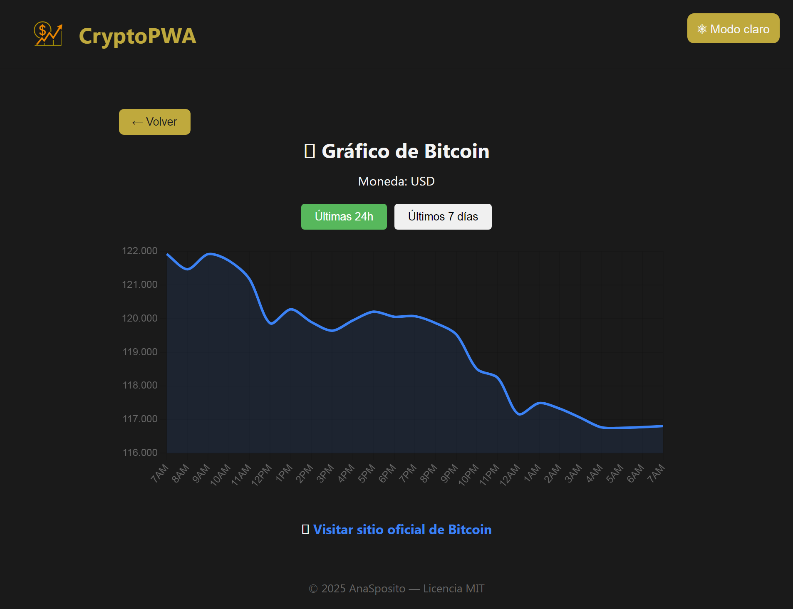

> Cotizador de criptomonedas en tiempo real — app instalable (PWA) con diseño responsive y modo oscuro/claro.

# 🚀 CryptoApp — Cotizador de criptomonedas en tiempo real

CryptoApp es una aplicación web moderna que permite visualizar el precio actualizado de distintas criptomonedas. Desarrollada con React, Vite y transformada en una PWA, ofrece una experiencia rápida, instalable y visualmente cuidada.

---

## ✨ Características

- Vista principal con selección de criptomonedas
- Detalle del precio actual y cambios recientes
- Diseño responsive con compatibilidad portrait / landscape
- Tema claro/oscuro con botón toggle flotante
- Animaciones sutiles en títulos y elementos clave
- Arquitectura de componentes clara y escalable
- Instalación como app en dispositivos móviles y desktop

---

## 🛠️ Tecnologías utilizadas

- React + Vite
- CSS modular + variables custom
- Vite Plugin PWA (para `manifest`, `service worker`, offline, etc.)
- Netlify para deploy automático desde GitHub
- DevTools + Lighthouse para validación de PWA

---

## 📲 Instalación como PWA

Podés instalar la app desde Chrome (mobile o desktop):

1. Abrí la app en [https://cotizador-crypto5.netlify.app](https://cotizador-crypto5.netlify.app)
2. Click en “Instalar” en la barra o menú del navegador 
3. ¡La app se comporta como una aplicación nativa!

---
## En Chrome móvil (Android)
1. Abrí la app en [https://cotizador-crypto5.netlify.app](https://cotizador-crypto5.netlify.app)

2. Tocá el ícono de tres puntos (⋮)

3. Buscá la opción: “Agregar a la pantalla principal”

4. Tocá “Instalar” o “Agregar”

## En Safari móvil (iPhone)
1. Abrí la app en [https://cotizador-crypto5.netlify.app](https://cotizador-crypto5.netlify.app)

2. Tocá el ícono “Compartir” (cuadro con flecha hacia arriba)

3. Seleccioná “Agregar a pantalla de inicio”

4. Confirmá nombre, ícono, y listo

🔹 Safari no muestra banner, solo esa opción de compartir.

## 🧩 Estructura del proyecto
crypto-pwa/
├── public/
│   ├── icon-192.png
│   ├── icon-512.png
│   ├── _redirects
│   └── index.html
├── src/
│   ├── App.jsx
│   ├── main.jsx
│   ├── pages/
│   ├── components/
│   └── assets/
├── package.json
├── vite.config.js

---

## 📦 Deploy

El proyecto se publica automáticamente en Netlify al hacer `push` al branch `main`.

- **Build command:** `npm run build`
- **Publish directory:** `/dist`

---

## 🧠 Aprendizaje y motivación

Este proyecto forma parte del proceso de consolidación como desarrolladora frontend profesional, trabajando desde el código hasta la instalación real como app. El foco estuvo en lograr:

- Experiencia de usuario fluida
- Estética pensada para mobile
- Documentación clara y deploy controlado

---

## 📄 Licencia

MIT License

---

